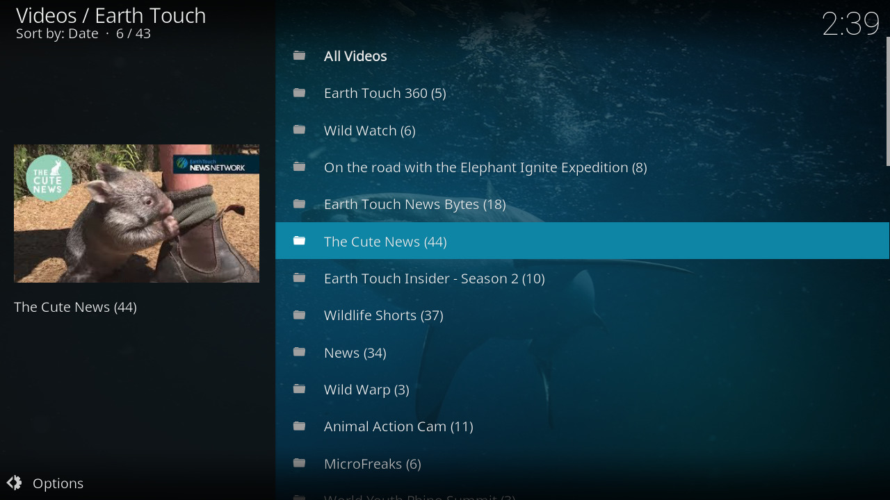
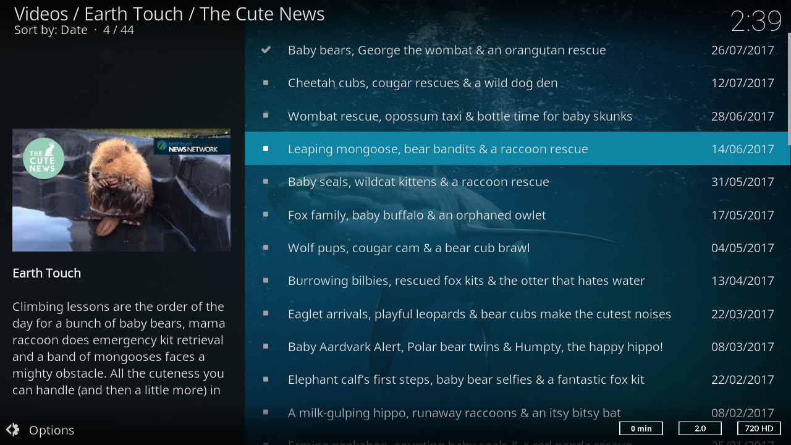
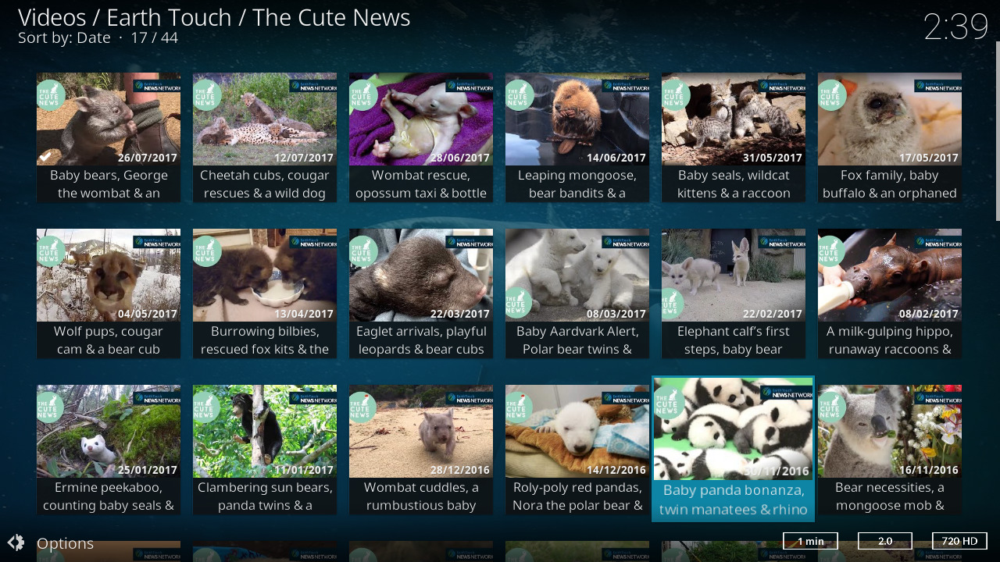

.. image:: https://travis-ci.org/willforde/plugin.video.earthtouch.svg?branch=master
    :target: https://travis-ci.org/willforde/plugin.video.earthtouch

.. image:: https://coveralls.io/repos/github/willforde/plugin.video.earthtouch/badge.svg?branch=master
    :target: https://coveralls.io/github/willforde/plugin.video.earthtouch?branch=master

.. image:: https://api.codacy.com/project/badge/Grade/7b82531be21b45fab751013235aaa146
    :target: https://www.codacy.com/app/willforde/plugin.video.earthtouch?utm_source=github.com&amp;utm_medium=referral&amp;utm_content=willforde/plugin.video.earthtouch&amp;utm_campaign=Badge_Grade

Earth Touch
===========

This is a kodi video add-on for Earth Touch nature videos.
See nature's drama unfold on Earth Touch.

Earth Touch News Network is a platform for the latest news and emerging stories about the natural world. Writers,
filmmakers and other contributors scattered across the globe are brought together by a common mission to tell those
stories simply and accurately, so they can reach like-minded nature lovers anywhere.

Download
--------
The add-on is available in the official kodi repository for kodi v17 "Krypton" and later.

**Automated Tests:** https://travis-ci.org/willforde/plugin.video.earthtouch
